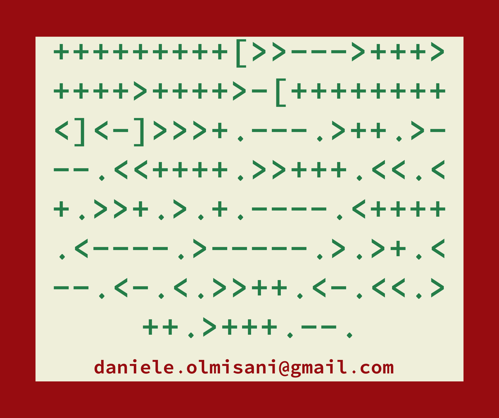

# Signatures

## Brainfuck

geeky signature (151 bytes; 5.8 bytes/output)

```bf
+++++++++[>>--->+++>
++++>++++>-[++++++++
<]<-]>>>+.---.>++.>-
--.<<++++.>>+++.<<.<
+.>>+.>.+.----.<++++
.<----.>-----.>.>+.<
--.<-.<.>>++.<-.<<.>
++.>+++.--.
```



### How it works

Create the following values at the first places of memory ```0, 0, 45, 99, 108, 108, 63```

```bf
+++++++++[>>--->+++>++++>++++>-[++++++++<]<-] 
```

Then dump each letter.

```
 d   a  n   i   e   l   e   .  o   l   m   i   s   a  n   i   @  g   m   a  i   l   .  c  o   m 
100 97 110 105 101 108 101 46 111 108 109 105 115 97 110 105 64 103 109 97 105 108 46 99 111 109 
```

### Tools

* https://fatiherikli.github.io/brainfuck-visualizer/
* https://tnu.me/brainfuck/generator

### Design


### C64 Quine

```
1 READA$:PRINTA$CHR$
(34)A$CHR%(34):DATA"
1 READA$:PRINTA$CHR$
(34)A$CHR%(34):DATA"
```


