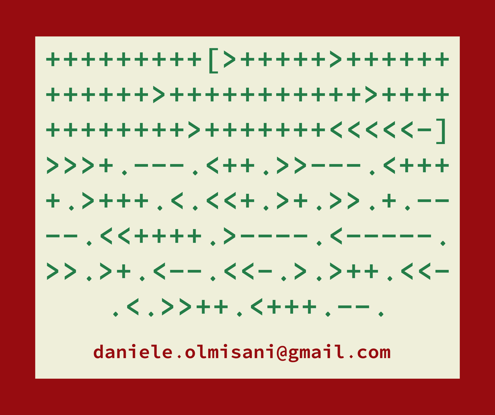

# bf-signature
geeky signature (186 chars)

```
+++++++++[>+++++>+++++++>+++++++++++>+
+++++++++++<<<<-]>>>+.---.>++.-----.<+
+++.>+++.<.<<+.>>>+++.---.+.<++++.>+++
+++.<--------.>-----.-----.<<+.>>--.++
++++.<.>----.+++.<<<.>>++.>+++.--.####
```

```
+++++++++[>+++++>++++++++++++>++++++++
+++>++++++++++++>+++++++<<<<<-]>>>+.--
-.<++.>>---.<++++.>+++.<.<<+.>+.>>.+.-
---.<<++++.>----.<-----.>>.>+.<--.<<-.
>.>++.+++.<<<.>>++.<++.--.############
```


 

### How it works

```
+++++++++[>+++++>+++++++>+++++++++++>++++++++++++<<<<-]
 ````
 
Create the following values at the first places of memory ```0, 45, 63, 99, 108```

Then dump each letter

```
>>>+.
---.
>++.
-----.
<++++.
>+++.
<.
<<+.
>>>+++.
---.
+.
<++++.
>++++++.
<--------.
>-----.
-----.
<<+.
>>--.
++++++.
<.
>----.
+++.
<<<.
>>++.
>+++.
--.
```

## Tools

* https://fatiherikli.github.io/brainfuck-visualizer/

```
 d   a  n   i   e   l   e   .  o   l   m   i   s   a  n   i   @  g   m   a  i   l   .  c  o   m 
100 97 110 105 101 108 101 46 111 108 109 105 115 97 110 105 64 103 109 97 105 108 46 99 111 109 
```
