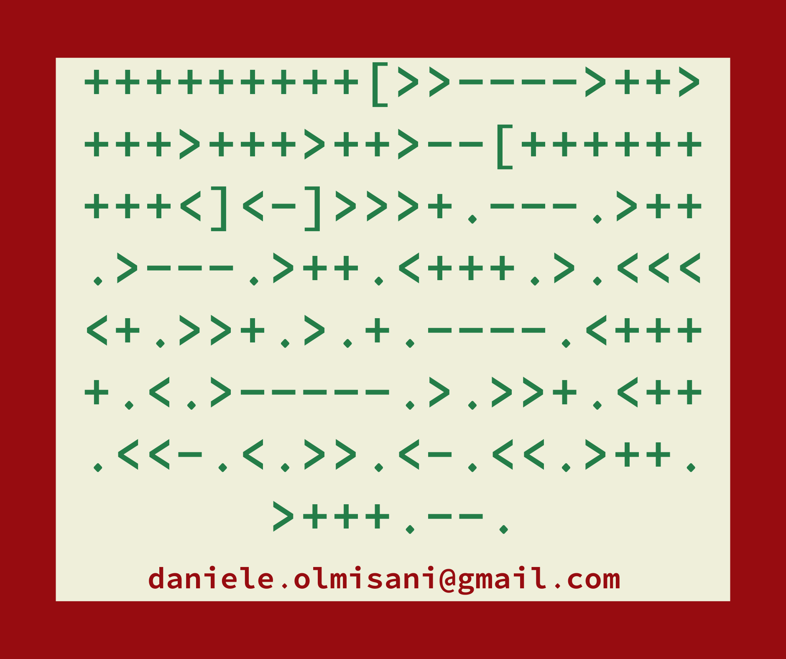
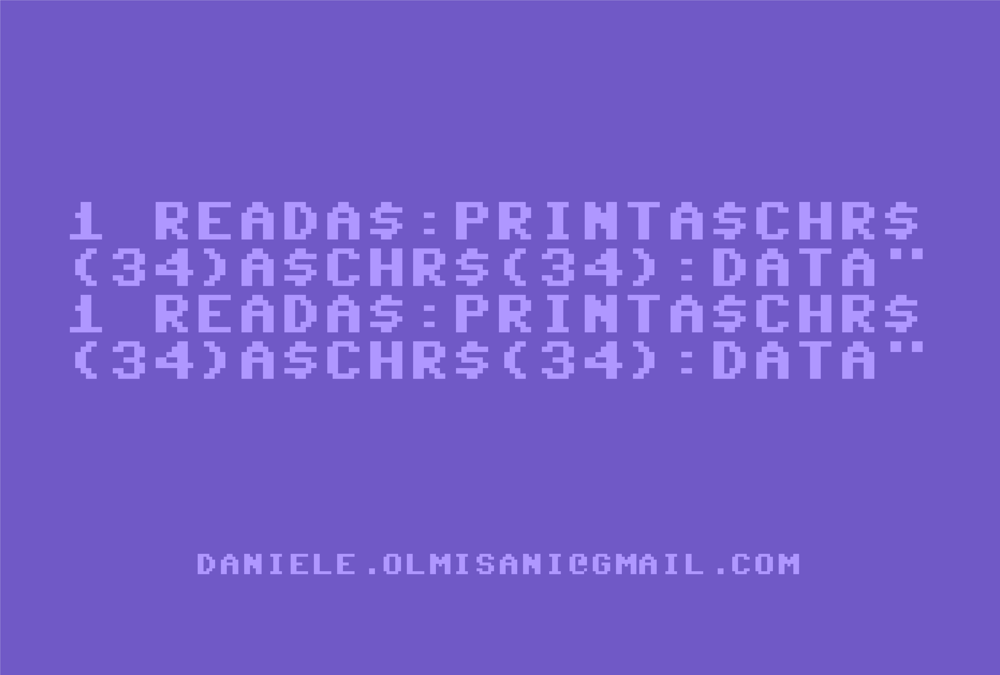
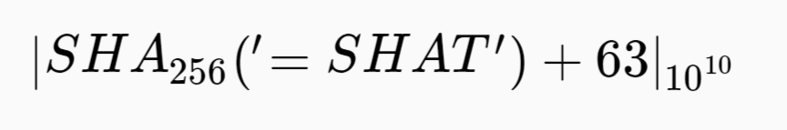

# Signatures

## Brainfuck

geeky signature (148 bytes; 5.7 instructions per character)

```bf
+++++++++[>>---->++>
+++>+++>++>--[++++++
+++<]<-]>>>+.---.>++
.>---.>++.<+++.>.<<<
<+.>>+.>.+.----.<+++
+.<.>-----.>.>>+.<++
.<<-.<.>>.<-.<<.>++.
>+++.--.
```




### How it works

Create the following values at the first places of memory ```0, 0, 45, 99, 108, 108, 99, 63```

```bf
+++++++++[>>---->++>+++>+++>++>--[+++++++++<]<-]
```

The inner loop multiplies the seed (9) by the inner increment to produce each base value:

| Cell | Value | Notes |
|------|-------|-------|
| 0    |   0   | loop counter (exhausted) |
| 1    |   0   | unused |
| 2    |  45   | `−` — base offset (9 × −5 = −45 → wrapped) |
| 3    |  99   | `c` — 9 × 11 |
| 4    | 108   | `l` — 9 × 12 |
| 5    | 108   | `l` — 9 × 12 |
| 6    |  99   | `c` — extra precomputed base (saves movements in output) |
| 7    |  63   | `?` — 9 × 7 |

Then dump each letter by navigating between cells and adjusting values with `+`/`-`:

```
 d   a  n   i   e   l   e   .  o   l   m   i   s   a  n   i   @  g   m   a  i   l   .  c  o   m 
100 97 110 105 101 108 101 46 111 108 109 105 115 97 110 105 64 103 109 97 105 108 46 99 111 109 
```

The extra `99` cell (compared to the 151-char solution) costs 3 characters in the init loop but saves 6 in the output section, for a net gain of 3 characters.

### Tools

* https://ashupk.github.io/Brainfuck/brainfuck-visualizer-master/
* https://tnu.me/brainfuck/generator

## Design


## C64 Quine

```
1 READA$:PRINTA$CHR$
(34)A$CHR%(34):DATA"
1 READA$:PRINTA$CHR$
(34)A$CHR%(34):DATA"
```



## Numbers

### Hex

```
Daniele Olmisani
44616E69656C65204F6C6D6973616E69

daniele.olmisani@gmail.com
64616E69656C652E6F6C6D6973616E6940676D61696C2E636F6D

01100100 01100001 01101110 
01101001 01100101 01101100 
01100101 00101110 01101111 
01101100 01101101 01101001 
01110011 01100001 01101110 
01101001 01000000 01100111 
01101101 01100001 01101001 
01101100 00101110 01100011 
01101111 01101101

```

### Mobile

```python
print((int.from_bytes(hashlib.sha256(b"=SHAT").digest())+63) % 10**10)
```

```latex
\[|SHA_{256}(=SHAT)+63|_{10^{10}}\]
```



Otherwise...

Python:

```python
print(map(ord,'舩숹'))

# whithout spaces
# print(*map(ord,'舩숹'),sep='')
```

J (APL):

```j
,/":u:'舩숹'
```

### Some useful tips

``` bash
$ echo -n "Daniele Olmisani" | hexdump -v -e '/1 "%02X"' ; echo
44616E69656C65204F6C6D6973616E69
```
